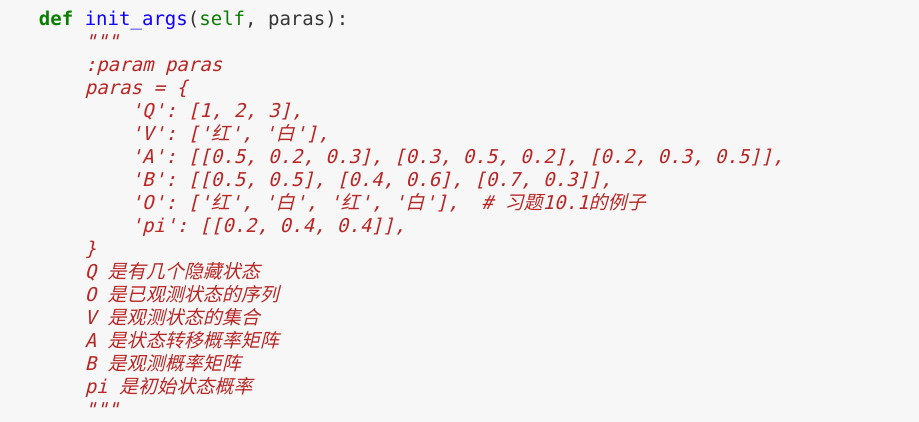
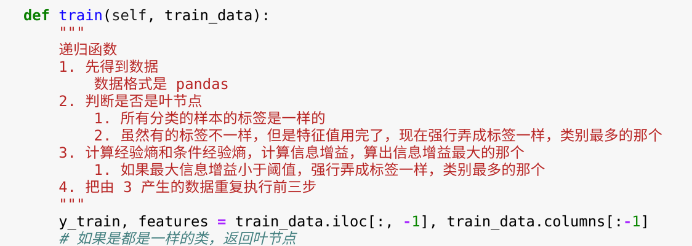
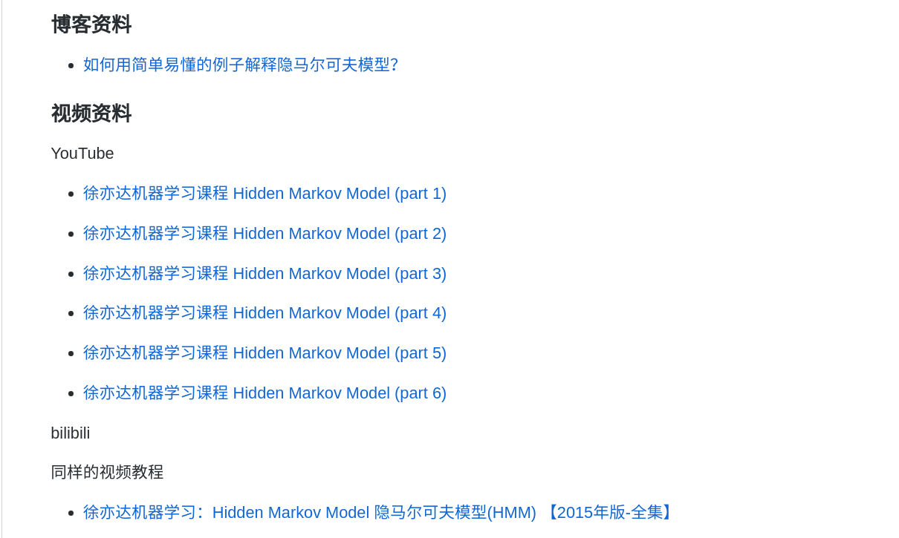
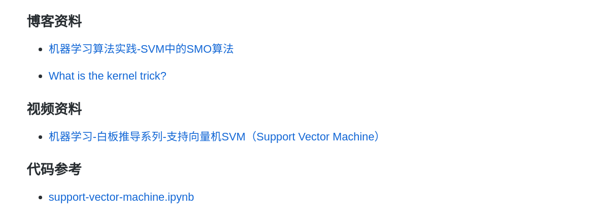

# 学习《统计学习方法》

## 介绍

花了两个月的时间去学习，又花了整整三天的时间把实现过的代码重新写在 **Jupyter** 上面，并尽量写清楚注释。

**过程真的很艰难，越学习越知道自己不懂的越多**。比如 `最大熵` 和 `SMO` 算法卡了很久才勉强弄懂大概。又比如，书上的 `改进的迭代尺度法` 的证明。看的也是一脸懵逼。

在学习计算机的道路上慢慢熬下去吧。与诸位共勉

**第一次这么认真完成一个仓库**

+ 每一章的代码我都尽量写清楚注释

+ 为了方便阅读，我把代码重新写在了 **Jupyter** 上面

+ 在每一章，我都留下了我看过的视频和博客，以及自己写的博客。方便后来者学习。

## 目录

代码全部都在 `code` 文件夹里面

第2章 感知机

第3章 k近邻法

第4章 朴素贝叶斯

第5章 决策树

第6章 逻辑斯谛回归

第7章 支持向量机

第8章 提升方法

第9章 EM算法及其推广

第10章 隐马尔可夫模型

## 代码参考

不参考别人的代码，我是不可能写出来的。这里有三个大神的仓库，也是实现《统计学习方法》

+ [fengdu78](https://github.com/fengdu78/lihang-code)

+ [wzyonggege](https://github.com/wzyonggege/statistical-learning-method)

+ [Dod-o](https://github.com/Dod-o/Statistical-Learning-Method_Code)

## 最后

看我这么认真写了注释，还把视频教程分享了出来。给个 **star** 吧！

扫个码我们做朋友吧！

